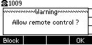

# Sippy Click for Yealink

Sippy Click browser extension for Yealink devices.

This is a native extension that should work with desk phones from Yealink.

## Yealink configuration

In order to make this extension work you'll need to configure Yealink to accept remote actions.
This can be archived by loging into the device then go to "Features" > "Remote Control" and set "Action URI Allow IP List" to the IP-address on which you use this browser extension. You can also set "any" to allow it from anywhere, but be carefull with this configuration.

The following values are allowed:

- Full IP-address (192.168.0.123)
- Partial IP-address (192.168.0.* or 192.168.*.*)
- "any"

When you trigger a call for the first time a pop-up may appear on the Yealink device, you'll need to press "OK" to allow remote control.

## Notice

Only use this extension on local trusted networks as the way authentication works is not very secure. To protect you further you should set your IP-address in the "Action URI Allow IP List" configuration instead of "any". Also, you should never expose your device to the public network!

## Copyright and License

Copyright (c) 2021 Optimise Group

Licensed under the Apache License, Version 2.0 (the "License"); you may not use this file except in compliance with the License. You may obtain a copy of the License at https://www.apache.org/licenses/LICENSE-2.0.

Unless required by applicable law or agreed to in writing, software distributed under the License is distributed on an "AS IS" BASIS, WITHOUT WARRANTIES OR CONDITIONS OF ANY KIND, either express or implied. See the License for the specific language governing permissions and limitations under the License.
